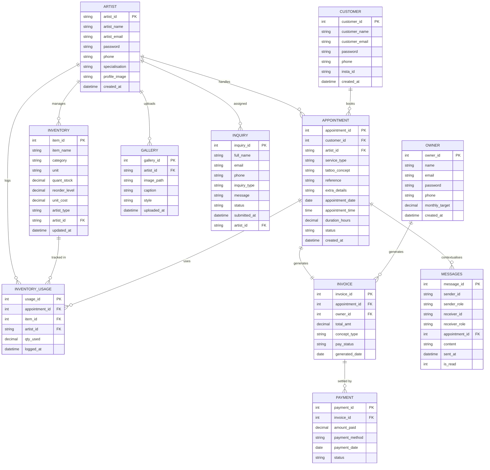

# ER Diagram — Dragon Tattoos Studio Management System
## Chen Notation (Mermaid `erDiagram`)

> **Chen Notation Key:**
> - `||--o{` = one-to-many
> - `||--||` = one-to-one
> - `PK` = Primary Key · `FK` = Foreign Key

---

## Entity Summary Table

| Entity            | PK               | Description                              |
|------------------|------------------|------------------------------------------|
| `OWNER`           | `owner_id`       | Studio owner / admin                     |
| `CUSTOMER`        | `customer_id`    | Registered clients                       |
| `ARTIST`          | `artist_id`      | Staff artists (e.g. `DRAG-ART-001`)      |
| `APPOINTMENT`     | `appointment_id` | Service booking record                   |
| `GALLERY`         | `gallery_id`     | Artist portfolio images                  |
| `INQUIRY`         | `inquiry_id`     | Pre-booking customer inquiries           |
| `INVENTORY`       | `item_id`        | Supply / material stock items            |
| `INVENTORY_USAGE` | `usage_id`       | Bridge: Appointment ↔ Inventory (N:M)   |
| `INVOICE`         | `invoice_id`     | Financial billing per appointment        |
| `PAYMENT`         | `payment_id`     | Payment transaction per invoice          |
| `MESSAGES`        | `message_id`     | Chat between Customer ↔ Artist           |

---

## Relationship Summary (Chen Cardinality)

| Relationship                        | Cardinality | Participation         |
|-------------------------------------|-------------|----------------------|
| OWNER → INVOICE                     | 1 : N       | Total / Partial       |
| CUSTOMER → APPOINTMENT              | 1 : N       | Total / Partial       |
| ARTIST → APPOINTMENT                | 1 : N       | Partial / Partial     |
| APPOINTMENT → INVOICE               | 1 : 1       | Total / Partial       |
| INVOICE → PAYMENT                   | 1 : N       | Total / Partial       |
| ARTIST → GALLERY                    | 1 : N       | Total / Partial       |
| ARTIST → INQUIRY (assigned)         | 1 : N       | Partial / Partial     |
| ARTIST → INVENTORY                  | 1 : N       | Partial / Partial     |
| APPOINTMENT × INVENTORY (via Usage) | N : M       | Partial / Partial     |
| ARTIST → INVENTORY_USAGE            | 1 : N       | Total / Partial       |
| APPOINTMENT → MESSAGES              | 1 : N       | Partial / Partial     |
